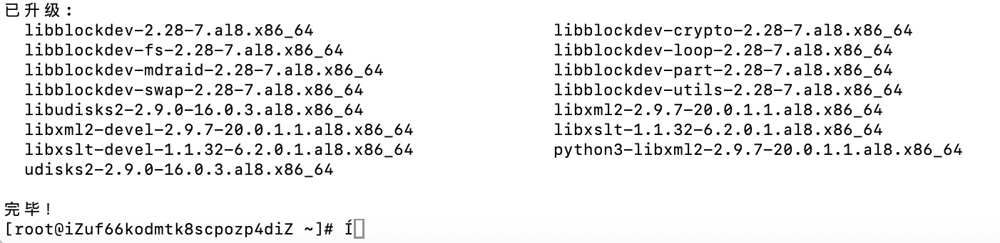

# Gaoruan
高软实验

## 实验2 搭建git
准备一个阿里云ESC实例，通过ssh连接到服务器。
自托管的Git仓库平台选择Gitea
### 2.1在ESC上安装Gitea
1.更新系统
```bash
sudo yum update -y
```


2.安装git
```bash
sudo yum install git -y
```


3.安装数据库
选择SQLite
```bash
sudo yum install sqlite -y
```


4.创建git用户
为了良好的实践，gitea最好在自己的用户下运行
```bash
sudo useradd --system --comment "Git User for Gitea" --home-dir /home/git --shell /bin/bash git
```


5.下载Gitea
访问Gitea发布页面，找到适用于ESC服务器的最新二进制文件链接
```bash
wget https://github.com/go-gitea/gitea/releases/download/v1.21.11/gitea-1.21.11-linux-amd64
sudo mv gitea-1.21.11-linux-amd64 /usr/local/bin/gitea
sudo chmod +x /usr/local/bin/gitea
```
由于下载的太慢，选择本地下载后使用scp传到服务器上，然后移动到正确的安装路径
```bash
sudo mv /root/gitea-1.21.11-linux-amd64 /usr/local/bin/gitea
sudo chmod +x /usr/local/bin/gitea
```


6.创建gitea运行需要的目录
```bash
sudo mkdir -p /etc/gitea /var/lib/gitea/{custom,data,log}
sudo chown -R git:git /etc/gitea /var/lib/gitea
sudo chmod -R 750 /var/lib/gitea
```


7.创建systemd服务文件
允许gitea自动启动和管理
```bash
sudo vim /etc/systemd/system/gitea.service
```
```Ini
[Unit]
Description=Gitea (Git with a cup of tea)
After=syslog.target
After=network.target
# 如果您使用了其他数据库（如MySQL或PostgreSQL），请取消注释并确保服务名称正确
# After=mysqld.service
# After=postgresql.service

[Service]
Type=simple
User=git
Group=git
WorkingDirectory=/var/lib/gitea/
ExecStart=/usr/local/bin/gitea web --config /etc/gitea/app.ini
RestartSec=2s
Restart=always
Environment=USER=git HOME=/home/git GITEA_WORK_DIR=/var/lib/gitea

[Install]
WantedBy=multi-user.target
```


8.重新加载systemd配置，并启动gitea
```bash
sudo systemctl daemon-reload
sudo systemctl start gitea
sudo systemctl enable gitea
sudo systemctl status gitea
```
9.开放端口22和3000

### 2.2通过web页面进行gitea初始配置
导航到http://your_ecs_public_ip:3000，请按照以下建议填写信息：
- 数据库类型：选择 SQLite3（最简单，适用于本次实验）。
- 数据库路径：/var/lib/gitea/data/gitea.db (保持默认)
- 应用名称：例如 My Git Platform
- 仓库根路径：/var/lib/gitea/data/gitea-repositories (保持默认)
- SSH 服务器域名：填写您的 ECS 实例的 公网IP地址，例如 your_ecs_public_ip。
- SSH 端口：22 (默认)
- Gitea HTTP 监听端口：3000 (默认)
- Gitea 基础 URL：http://your_ecs_public_ip:3000/ (确保与您的公网IP和端口匹配)
- 日志路径：/var/lib/gitea/log (保持默认)
- 管理员账户设置：务必创建第一个管理员账户。牢记您设置的用户名和密码，这是您登录 Gitea 管理界面的凭证。

填写完毕后，点击“安装 Gitea”。


### 2.4 测试功能


